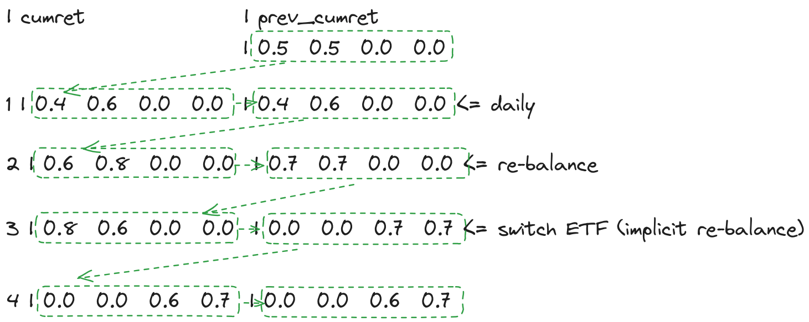

```{r setup, warning=FALSE, message=FALSE}
library(conflicted)
library(tidyverse)
library(lubridate)
library(testit)
library(kableExtra)
library(frenchdata)
library(patchwork)
conflict_prefer('last', "dplyr")
conflict_prefer("lag", "dplyr")
conflict_prefer("filter", "dplyr")
options(dplyr.summarise.inform = FALSE)
source("portfolio_functions.R")
```

# 0. Synopsis

-   This is a backtesting exercise for investment of a stock portfolio.
-   There are various types of backtesting: vectorized, event-based,
    etc. We use a hybrid method of vectorized and event-based. The
    trading signal is generated row-by-row (i.e. day-by-day) while the
    return is calculated in vector to speed up.
-   In a nutshell, the value of the portfolio is calculated with
    following pipeline.

$$
\left.\begin{matrix}
\text{Strategy Signal (Picker / Re-balance)} \rightarrow \text{Allocation (weights)} \\
\text{Price} \rightarrow \text{Return} \\
\text{Return} \rightarrow \text{Cumulative Return} \\
\end{matrix}\right\}\rightarrow
\text{Value of the portfolio}
$$

-   Disclaimer: this is no an investment advise.

# 1. Overview

-   SPDR sector ETFs divides S&P 500 into eleven sector index funds.
    <https://www.sectorspdrs.com/>. Vanguard has similar ETF
    <https://investor.vanguard.com/investment-products/list/etfs?assetclass=sector_specialty>
-   We chose 9 among them and `SPY`, which is the S&P ETF.
-   Investment horizon, long-term from 1999-11-01 to 2021-10-08.
-   Strategy:
    -   Equal-weighted with 1) no re-balance, 2) quarterly re-balance,
        3)  annual re-balance
    -   Picker by alpha from Fama-French 3 factor model
-   Note:
    -   All equity position, no cash.
    -   Do not load other library, use only the listed packages here.
    -   Submit Rmd and the data files together
    -   Use adjusted_close.

SPDR funds are managed by State Street Global Advisors (SSGA) with SPDR
a trademark of Standard and Poor's Financial Services LLC, a subsidiary
of S&P Global. SPDR original stands for "Standard & Poor's Depositary
Receipts".

For a long time, SPDR S&P 500 Trust ETF (SPY) was the largest ETF in the
world. The sector ETFs divides the S&P 500 companies to attract
investors for sector-specific investments. There are following ETFs and
their industries.

-   XLC: Communication Services Select Sector SPDR
-   XLB: Materials Select Sector SPDR
-   XLE: Energy Select Sector SPDR
-   XLF: Financial Select Sector SPDR
-   XLI: Industrial Select Sector SPDR
-   XLK: Technology Select Sector SPDR
-   XLP: Consumer Staples Select Sector SPDR
-   XLU: Utilities Select Sector SPDR
-   XLV: Health Care Select Sector SPDR
-   XLRE: Real Estate Select Sector SPDR
-   XLY: Consumer Discretionary Select Sector SPDR

Another notable mutual funds and ETF provider, Vanguard has similar
offering.

-   VOX: Communication Services ETF
-   VCR: Consumer Discretionary ETF
-   VDC: Consumer Staples ETF
-   VDE: Energy ETF
-   VFH: Financials ETF
-   VHT: Health Care ETF
-   VIS: Industrials ETF
-   VGT: Information Technology ETF
-   VAW: Materials ETF
-   VNQ: Real Estate ETF
-   VPU: Utilities ETF
-   VTI: Vanguard Total Stock Market ETF (similar to SPY)

We will use SPDR's data in this exercise.

## 1.1 Use downloaded data

Data have been pre-downloaded.

```{r}
# "XLC", "XLRE" has shorter history, skip them.
all_tickers <- c("XLB", "XLE", "XLF", "XLI", "XLK", "XLP", "XLU", "XLV", "XLY", "SPY")

length(all_tickers)

path_to_rds <- "./SPDR/"
```

## 1.2 Load and check

```{r}
# make sure all starts from the same time and same length.
# load each data as df_xxx

dd <- list()
dd_adjusted_close <- list()
for (tt in all_tickers) {
  dd[[tt]] <- readRDS(paste0(path_to_rds, tt, ".Rds"))
  dd_adjusted_close[[tt]] <- dd[[tt]] %>%
    select(adjusted_close) %>%
    rename_with(.fn = \(x) tt,
                .cols = "adjusted_close")
  print(paste(tt, min(dd[[tt]]$timestamp), max(dd[[tt]]$timestamp), nrow(dd[[tt]])))
  assert(min(dd[[tt]]$timestamp) == as.Date("1999-11-01"))
  assign(paste0("df_", tolower(tt)), dd[[tt]], envir = .GlobalEnv)
}
```

```{r}
(df_all <- bind_cols(select(dd[[tt]], timestamp),
                     do.call("bind_cols", dd_adjusted_close)))
```

```{r}
# Last row with return from each ETF
tail(df_all, 1) %>% select(!timestamp) / head(df_all, 1) %>% select(!timestamp) - 1
```

## 1.3 Background of last 20 years: Energy vs. Technology

-   Energy was the rock star during 90s and 00s, abruptly stopped during
    GFC on the journey towards \$200/bbl (never there).
-   Technology was a prodigy from late 70s, stumbled in early 00s (dot
    com bubble), but now a rock star.
-   Every sector has its peak and trough.

```{r fig.width=6}
p1 <- df_all %>%
  select(!SPY) %>%
  pivot_longer(cols = !timestamp) %>%
  ggplot(.) + geom_line(aes(timestamp, value, colour = name))

p2 <- df_all %>%
  select(timestamp, XLE, XLK) %>%
  pivot_longer(cols = !timestamp) %>%
  ggplot(.) + geom_line(aes(timestamp, value, colour = name))

p1 / p2
```

# 2. Equal-weighted Strategy (no re-balance)

Equal-weighted portfolio, also called `1/N` is a common non-biased
strategy for asset allocation weight. With re-balance, it can show good
performance over long term. We will do a no re-balance version first.

## 2.1 Compute daily return series

```{r}
len_tickers <- length(all_tickers)
ii <- 1
daily_ret <- tail(tibble(Date = dd[[1]]$timestamp), -1)
# XXX records each ETF's daily return (Net Return < 1)
for (ii in 1:len_tickers) {
  daily_ret[all_tickers[ii]] <- tail(dd[[ii]]$adjusted_close / lag(dd[[ii]]$adjusted_close, 1) - 1, -1)
}
# XXX_cumret records each ETF's cumulative return (R_{t+1}/R_{t})
for (ii in 1:len_tickers) {
  daily_ret[paste0(all_tickers[ii], "_cumret")] <- cumprod(1 + daily_ret[all_tickers[ii]])
}
head(daily_ret)
```

## 2.2 Performance

### 2.2.1 Calculate Equity Curve (no re-balance)

`w` is the weight of each ETF in the portfolio.

```{r}
invest_tickers <- all_tickers[all_tickers != "SPY"]
len_invest <- length(invest_tickers)
w <- rep(1, len_invest) / len_invest
cat(paste0("w: ", paste0(round(w, 3), collapse = ",")))
```

```{r fig.height=3}
# Test
# daily_ret %>% select(XLB_cumret:XLY_cumret) %>% tail(1) %>% as.matrix() %>% mean()

# We convert part of the data frame as matrix, perform the matrix multiplication and convert the matrix back to vector.
ew_cumret <- as.numeric(as.matrix(daily_ret %>% select(XLB_cumret:XLY_cumret)) %*% w)

ret_from_cumret <- function(cumret) {
  ret <- cumret / lag(cumret) - 1
  # filling the NA
  ret[1] <- cumret[1] - 1
  ret
}

# Test
# ret_from_cumret(daily_ret$XLB_cumret) - daily_ret$XLB

ew_ret <- ret_from_cumret(ew_cumret)

daily_ret["EW_cumret"] <- ew_cumret
daily_ret["EW"] <- ew_ret

daily_ret %>% ggplot(.) + geom_line(aes(Date, EW_cumret)) + ggtitle("EW (no-balance) Equity Curve")
```

### 2.2.2 Relative Performance between SPY v.s. EW (no re-balance)

1.  Daily return for SPY v.s. EW

```{r fig.height=3}
# EW (no re-balance) has similar return as SPY
ggplot(daily_ret) + geom_point(aes(SPY, EW)) + ggtitle("SPY vs EW")
```

2.  Cumulative return for SPY v.s. EW (no re-balance)

```{r fig.height=3}
# EW (no re-balance) has similar return as SPY, but higher.

daily_ret %>%
  ggplot(.) +
  geom_line(aes(Date, SPY_cumret, color = "SPY")) +
  geom_line(aes(Date, EW_cumret, color = "EW")) +
  ggtitle("SPY vs EW (no re-balance) Equity Curve") + labs(color = "Curve") +
  scale_color_manual(values = c("SPY" = "black", "EW" = "red"))+
  ylab('cumulative return')
```

### 2.2.3 Metric (TODO)

```{r}
# annualized return for EW
(annual_ret_EW <- prod(daily_ret$EW + 1) ** (250 / length(daily_ret$EW)) - 1)

# annualized return for SPYre
(annual_ret_SPY <- prod(daily_ret$SPY + 1) ** (250 / length(daily_ret$SPY)) - 1)
```

```{r}
# Modified Sharpe ratio: EW vs SPY. I assume risk-free rate = 0 here as I did not find quality data source for it.

SR_EW <- annual_ret_EW / sd(daily_ret$EW) / sqrt(250)
SR_SPY <- annual_ret_SPY / sd(daily_ret$SPY) / sqrt(250)

cat("Modified Sharpe ratio for EW Portfolio:\n", SR_EW, "\n")
cat("Modified Sharpe ratio for SPY:\n", SR_SPY, "\n\n")
```

```{r}
# Calculate the Max Draw Down:

# max_drawdown <-

# Calculate Maximum Drawdown for EW portfolio
mdd_EW <- max_drawdown(daily_ret$EW_cumret)

# Calculate Maximum Drawdown for SPY
mdd_SPY <- max_drawdown(daily_ret$SPY_cumret)

cat("Maximum Drawdown for EW Portfolio: ", mdd_EW, "\n")
cat("Maximum Drawdown for SPY: ", mdd_SPY, "\n")
```

### 2.2.4 Details (TODO)

#### 2.2.4.1 Ranking of ETFs by PnL

In section 2.2.4.1, PnL is calculated as $cumulative\_return - 1$ which
is also the so called $total\_return$. Notice that there is an explicit
relation between $total\_return$ of 9 ETFs invested and $total\_return$
of equal weightage portfolio constructed.

Let's define the following:

-   Let $TR_{EW}$​ be the total return of the equal-weighted portfolio
    over certain period.

-   Let $TR_i$​ be the total return of the $i-th$ ETF over certain
    period, where $i = 1,2,3…,9$ represents the 9 ETFs in the portfolio.

-   In an equal-weighted portfolio, each ETF is given the same weight,
    so each ETF contributes equally to the portfolio's overall return.

Since the equal-weighted portfolio is constructed by assigning each ETF
an equal weight of $\frac{1}{9}$​, the total return of the portfolio is
the average of the total returns of the individual ETFs:

$$
TR_{\text{EW}} = \frac{1}{9} \sum_{i=1}^{9} TR_i
$$

##### ​2.2.4.1.1 Static Ranking by PnL

In this section, static ranking refers to the final ranking at the end
of investment period

```{r}
# Consider using reusable function
dynamic_ranking_pnl(tail(daily_ret,1),all_tickers)
```

##### 2.2.4.1.2 Dynamic Ranking by PnL

In this section, dynamic ranking refers to the ranking at the each
trading day across whole investment period.

```{r}
plot_dynamic_rankings_pnl(dynamic_ranking_pnl(daily_ret, all_tickers))
```

#### 2.2.4.2 Ranking of ETFs by Risk

```{r}
plot_max_drawdown_ranking(daily_ret, all_tickers)
```

# 3. EW with Re-balance

Re-balance is an action to reset the weights so the allocation into each
ETF has equal market value.

Without re-balance, some ETFs can grow heir value to a certain extend
that reduces the diversification of our investment portfolio.

-   The starting allocation for each ETF is 1/9.
-   On the next re-balance day, calculate the value of the portfolio.
    For example, it has grown to 1.3 based on each ETF's relative return
    during the previous period.
-   The allocation for each ETF becomes 1.3/9.

If there is no re-balance (as shown earlier), weight is multiplied to
the each ETF's cumulative return. This is like that we allocated the
capital equally on day 1 and future value is always 1/n \* cumulative
return. The overall cumulative return is the average of all
ETFs'cumulative returns.

If we re-balance every day (a special case), weight is multiplied to
each ETF's daily return. This is like that the we equally divide the
capital allocation for each ETF so the overall daily return is the
averaged daily returns of all ETFs.

## 3.1 Re-balance everyday (a special case)

It has improved over the non re-balance from 7.7% to 8.5%.

```{r fig.height=4}
daily_ret["EW_daily"] <- as.matrix(daily_ret %>% select(XLB:XLY)) %*% w
daily_ret["EW_daily_cumret"] <- cumprod(daily_ret[, "EW_daily", drop = TRUE] + 1)

p1 <- daily_ret %>% ggplot(.) + geom_line(aes(Date, EW_daily))
p2 <- daily_ret %>% ggplot(.) + geom_point(aes(EW, EW_daily))

p1 / p2
```

```{r}
# annualized return for EW_daily, higher than EW (no-balance)
prod(daily_ret$EW_daily + 1) ** (250 / length(daily_ret$EW_daily)) - 1
```

## 3.2 Re-balance generalized

Step 1: Calculate the dates for the re-balance.

The re-balance could happen at fixed time intervals. To simplify the
calculation, we set to have the last re-balance day happens on the last
day (the re-balance on the last day would not have impact to the profit
or loss) and derive the earlier re-balance days backward. I have written
the custom function `calc_rebal_days()` to obtain the `rebal_days`
vector. They are the n-th days on which re-balance is applied.

```{r}
calc_rebal_days <- function(nn, period) {
  rev(nn - (0:(round(nn / period, 0) - 1)) * period)
}

# Quarterly re-balance
# every 92 days
rebal_days <- calc_rebal_days(length(dd[[1]]$timestamp), 92)
head(rebal_days)

# Annual re-balance
# every 252 days
rebal_days <- calc_rebal_days(length(dd[[1]]$timestamp), 252)
head(rebal_days)
```

Step 2: generalized code to calculate return from allocation and
re-balance

Data frame `daily_ret` is composed of `Date`,
`daily return matrix from XLB:XLY`, SPY, `cumret matrix from XLB:XLY`
and EW results.

Previous `cumret` is directly calculate from each ETF's daily return.
With re-balance, `cumret` that records every ETF's daily cumulative
return in our portfolio will be calculated different.

We use a variable `prev_cumret` to record the previous day's `cumret`.

Each row of `cumret` matrix is calculated from
`prev_cumret * (1 + daily_return of each ETF)`.

When re-balance happens, we take that row of `cumret` and equalize each
to be `1/N` of the row's sum.

Below illustrates the row-by-row changes to `cumret` and `prev_cumret`
suppose we have 4 ETFs and we initially 50/50 only to the first two.

```         
  | cumret              | prev_cumret
                        | 0.5  0.5  0.0  0.0
1 | 0.4  0.6  0.0  0.0  | 0.4  0.6  0.0  0.0 <= daily
2 | 0.6  0.8  0.0  0.0  | 0.7  0.7  0.0  0.0 <= re-balance
3 | 0.8  0.6  0.0  0.0  | 0.0  0.0  0.7  0.7 <= switch ETF (implicit re-balance)
4 | 0.0  0.0  0.6  0.7  | 0.0  0.0  0.6  0.7
```



```{r fig.height=4}
# loc_cumret_matrix is where we have stored cumret for each ETF. We will re-write these columns' content.

loc_XLB <- which(colnames(daily_ret) == "XLB")
loc_XLY <- which(colnames(daily_ret) == "XLY")
loc_ret_matrix <- loc_XLB:loc_XLY

loc_XLB_cumret <- which(colnames(daily_ret) == "XLB_cumret")
loc_XLY_cumret <- which(colnames(daily_ret) == "XLY_cumret")
loc_cumret_matrix <- loc_XLB_cumret:loc_XLY_cumret
```

The below cell has been encapsulated in function
"`ew_rebalance_calculation`" in portfolio_functions.R

```{r}
### Deprecated

# row_daily_ret <- nrow(daily_ret)
# 
# # We set to re-balance every day, hope to reproduce the same result as in ## 3.1
# rebal_days <- 1:row_daily_ret
# w0 <- w
# for (ii in 1:row_daily_ret) {
#   if (ii == 1) {
#     prev_cumret <- matrix(w0, 1, len_invest)
#   }
#   daily_ret[ii, loc_cumret_matrix] <- prev_cumret * as.matrix(1 + daily_ret[ii, loc_ret_matrix])
# 
#   if (ii %in% rebal_days) {
#     # when re-balance, multiple weights with cumret
#     port_sum <- sum(daily_ret[ii, loc_cumret_matrix])
#     daily_ret[ii, loc_cumret_matrix] <- matrix(rep(port_sum, len_invest) / len_invest, 1, len_invest)
#   }
#   prev_cumret <- as.matrix(daily_ret[ii, loc_cumret_matrix])
# }
# # EW_Daily_cumret matches EW_daily_cumret. And EW_Daily matches EW_daily.
# daily_ret["EW_Daily_cumret"] <- rowSums(as.matrix(daily_ret[loc_cumret_matrix]))
# daily_ret["EW_Daily"] <- ret_from_cumret(daily_ret[, "EW_Daily_cumret", drop = TRUE])
# 
# p1 <- daily_ret %>% ggplot(.) + geom_line(aes(Date, EW_Daily_cumret))
# p2 <- daily_ret %>% ggplot(.) + geom_line(aes(Date, EW_Daily))
# 
# p1 / p2
```

```{r}
# Restructure daily-rebalance with functions
daily_ret <- ew_rebalance_calculation(daily_ret, loc_ret_matrix, loc_cumret_matrix, 1:5520,"d")

p1_own <- daily_ret %>% ggplot(.) + geom_line(aes(Date, EW_Daily_cumret))
p2_own <- daily_ret %>% ggplot(.) + geom_line(aes(Date, EW_Daily))

p1_own / p2_own
```

## 3.3 TODO

Now we have a generalized allocate and re-balance algorithm. Re-balance
daily would incur large amount of transaction cost. We will lower the
re-balance frequency. Test for two EW strategies with different
re-balance period: quarterly and annually. Perform similar analysis as
\## 2.2 Performance.

Hint: 1). create re-usable functions. 2) move the functions to a
separate script file to keep the R Markdown file clean, use `source()`
to load any R script file in the R markdown..

### 3.3.1 Re-balance quarterly

#### 3.3.1.1 Equity Curve

```{r}
# Quarterly re-balance
daily_ret <- ew_rebalance_calculation(daily_ret, loc_ret_matrix, loc_cumret_matrix,calc_rebal_days(length(dd[[1]]$timestamp), 92),"q")

p1_own <- daily_ret %>% ggplot(.) + geom_line(aes(Date, EW_Quarterly_cumret))
p2_own <- daily_ret %>% ggplot(.) + geom_line(aes(Date, EW_Quarterly))

p1_own / p2_own
```

#### 3.3.1.2 **Relative Performance between SPY v.s. EW (re-balance quarterly)**

1.  Daily return for SPY v.s. EW (re-balance quarterly)

```{r fig.height=3}
# EW (re-balance quarterly) has similar return as SPY
ggplot(daily_ret) + geom_point(aes(SPY, EW_Quarterly)) + ggtitle("SPY vs EW (rebalance quarterly)")
```

2.  Cumulative return for SPY v.s. EW (re-balance quarterly)

```{r fig.height=3}
# EW (re-balance quarterly) has similar return as SPY, but higher.
daily_ret %>%
  ggplot(.) +
  geom_line(aes(Date, SPY_cumret, color = "SPY")) +
  geom_line(aes(Date, EW_Quarterly_cumret, color = "EW")) +
  ggtitle("SPY vs EW (rebalance quarterly) Equity Curve") + labs(color = "Curve") +
  scale_color_manual(values = c("SPY" = "black", "EW" = "red"))+
  ylab('cumulative return')
```

#### 3.3.1.3 Metrics

```{r}
# annualized return for EW_Quarterly
(annual_ret_EW_Quarterly <- prod(daily_ret$EW_Quarterly + 1) ** (250 / length(daily_ret$EW_Quarterly)) - 1)

# annualized return for SPY
(annual_ret_SPY <- prod(daily_ret$SPY + 1) ** (250 / length(daily_ret$SPY)) - 1)
```

```{r}
SR_EW_Quarterly <- annual_ret_EW_Quarterly / sd(daily_ret$EW_Quarterly) / sqrt(250)
SR_SPY <- annual_ret_SPY / sd(daily_ret$SPY) / sqrt(250)

cat("Modified Sharpe ratio for EW Quarterly Portfolio:\n", SR_EW_Quarterly, "\n")
cat("Modified Sharpe ratio for SPY:\n", SR_SPY, "\n")
```

```{r}
# Calculate Maximum Drawdown for EW_Quarterly portfolio
mdd_EW_Quarterly <- max_drawdown(daily_ret$EW_Quarterly_cumret)

cat("Maximum Drawdown for EW Portfolio: ", mdd_EW_Quarterly, "\n")
cat("Maximum Drawdown for SPY: ", mdd_SPY, "\n")
```

#### 3.3.1.4 Details

##### 3.3.1.4.1 Ranking of ETFs by PnL

Notice that in this section, we still adopt total return (see [2.2.4.1
Ranking of ETFs by PnL]) as a symbol of PnL. Nevertheless, the
relationship between total return of 9 ETFs invested and total return of
EW(rebalancing) differs slightly from that in EW(without rebalacing)
which is shown below

$$
TR_{\text{EW_Rebalancing}} = \sum_{i=1}^{9} TR_i +8
$$

###### 3.3.1.4.1.1 Static Ranking by PnL

```{r}
# Consider using reusable function
dynamic_ranking_pnl(tail(daily_ret,1),all_tickers)
```

###### 3.3.1.4.1.2 Dynamic Ranking by PnL

```{r}
# Call the function to get dynamic rankings
plot_dynamic_rankings_pnl(dynamic_ranking_pnl(daily_ret, all_tickers))
```

##### 3.3.1.4.2 Ranking of ETFs by Risk

```{r}
plot_max_drawdown_ranking(daily_ret, all_tickers)
```

### 3.3.2 Re-balance yearly

#### 3.3.2.1 Equity Curve

```{r}
# Yearly re-balance
daily_ret <- ew_rebalance_calculation(daily_ret, loc_ret_matrix, loc_cumret_matrix,calc_rebal_days(length(dd[[1]]$timestamp),252),"y")

p1_own <- daily_ret %>% ggplot(.) + geom_line(aes(Date, EW_Yearly_cumret))
p2_own <- daily_ret %>% ggplot(.) + geom_line(aes(Date, EW_Yearly))

p1_own / p2_own
```

#### **3.3.2.2 Relative Performance between SPY v.s. EW (re-balance yearly)**

1.  Daily return for SPY v.s. EW (re-balance yearly)

```{r fig.height=3}
# EW (re-balance yearly) has similar return as SPY
ggplot(daily_ret) + geom_point(aes(SPY, EW_Yearly)) + ggtitle("SPY vs EW (rebalance yearly)")
```

2.  Cumulative return for SPY v.s. EW (re-balance yearly)

```{r fig.height=3}
# EW (re-balance yearly) has similar return as SPY, but higher.
daily_ret %>%
  ggplot(.) +
  geom_line(aes(Date, SPY_cumret, color = "SPY")) +
  geom_line(aes(Date, EW_Yearly_cumret, color = "EW")) +
  ggtitle("SPY vs EW (rebalance yearly) Equity Curve") + labs(color = "Curve") +
  scale_color_manual(values = c("SPY" = "black", "EW" = "red"))+
  ylab('cumulative return')
```

#### 3.3.2.3 Metrics

```{r}
# annualized return for EW_Yearly
(annual_ret_EW_Yearly <- prod(daily_ret$EW_Yearly + 1) ** (250 / length(daily_ret$EW_Yearly)) - 1)

# annualized return for SPY
(annual_ret_SPY <- prod(daily_ret$SPY + 1) ** (250 / length(daily_ret$SPY)) - 1)
```

```{r}
SR_EW_Yearly <- annual_ret_EW_Yearly / sd(daily_ret$EW_Yearly) / sqrt(250)

cat("Modified Sharpe ratio for EW Yearly Portfolio:\n", SR_EW_Yearly, "\n")
cat("Modified Sharpe ratio for SPY:\n", SR_SPY, "\n")
```

```{r}
# Calculate Maximum Drawdown for EW_Yearly portfolio
mdd_EW_Yearly <- max_drawdown(daily_ret$EW_Yearly_cumret)

cat("Maximum Drawdown for EW Portfolio: ", mdd_EW_Yearly, "\n")
cat("Maximum Drawdown for SPY: ", mdd_SPY, "\n")
```

#### 3.3.2.4 Details

##### 3.3.2.4.1 Ranking of ETFs by PnL

###### 3.3.2.4.1.1 Static Ranking by PnL

```{r}
# Consider using reusable function
dynamic_ranking_pnl(tail(daily_ret,1),all_tickers)
```

###### 3.3.2.4.1.2 Dynamic Ranking by PnL

```{r}
plot_dynamic_rankings_pnl(dynamic_ranking_pnl(daily_ret, all_tickers))
```

##### 3.3.2.4.2 Ranking of ETFs by Risk

```{r}
plot_max_drawdown_ranking(daily_ret, all_tickers)
```

# 4. Fama-French Selection

This allocation method is based on Fama-French's data.

For every month, obtain the alpha of the ETF for its last 3 months'
return with Fama-French 3 factors. Allocate investment equally to the
top 5 ETFs of the largest alpha.

Implement above allocation scheme and perform similar analysis as \##
2.2 Performance. Analyze the reason for different performance between
this strategy to EW (quarterly re-balanced).

You can assume 21 days per month. For the first three months, keep all
in cash.

Below is demo code to get started.

```{r}
# Download data
ff_data_daily <- tryCatch(
  {
    ff <- download_french_data("Fama/French 3 Factors [Daily]",
                               dir = ".", overwrite = FALSE)
    df <- ff$subsets$data[[1]] %>% mutate(date = ymd(date))
    saveRDS(df, file = "F-F_Research_Data_Factors_Daily_CSV.Rda")
    df
  },
  error = function(e) {
    df <- readRDS("F-F_Research_Data_Factors_Daily_CSV.Rda")
    df
  }
)

# Merge with ETF's daily return data
daily_ret_ff <- left_join(daily_ret, ff_data_daily, by = c("Date" = "date"))
```

```{r}
rebal_days <- calc_rebal_days(length(dd[[1]]$timestamp), 21)
```

```{r}
# Drop unused columns to speed up manipulation
daily_ret_ff <- daily_ret_ff %>%
  select(-starts_with("EW"), EW_Quarterly, EW_Quarterly_cumret)

daily_ret_ff[, loc_cumret_matrix] <- NA
```

```{r}
cash_reserved_months<-3
daily_ret_ff <- ew_fama_rebalance_calculation(daily_ret_ff,loc_ret_matrix,loc_cumret_matrix,rebal_days,cash_reserved_months,all_tickers)
```

## 4.1 Equity Curve

```{r}
p1_own <- daily_ret_ff %>% ggplot(.) + geom_line(aes(Date, EW_Fama_cumret))
p2_own <- daily_ret_ff %>% ggplot(.) + geom_line(aes(Date, EW_Fama))

p1_own / p2_own
```

## 4.2 Relative Performance between EW (re-balance quarterly) v.s. EW (ff3 re-balancing)

1.  Daily return for EW (re-balance quarterly) v.s. EW (ff3
    re-balancing)

```{r fig.height=3}
# EW (ff3 re-balancing) has similar return as EW (re-balance quarterly)
ggplot(daily_ret_ff) + geom_point(aes(EW_Quarterly,EW_Fama)) + ggtitle("EW (rebalance quarterly) vs EW (ff3 re-balancing)")
```

2.  Cumulative return for EW (re-balance quarterly) v.s. EW (ff3
    re-balancing) with SPY as benchmark

```{r}
daily_ret_ff %>%
  ggplot(.) +
  geom_line(aes(Date, SPY_cumret, color = "SPY")) +
  geom_line(aes(Date, EW_Quarterly_cumret, color = "EWQ")) +
  geom_line(aes(Date, EW_Fama_cumret, color = "EWF"))+
  ggtitle("SPY vs EW (rebalance quarterly) vs EW (fama rebalancing) Equity Curve") + labs(color = "Curve") +
  scale_color_manual(values = c("SPY" = "black", "EWQ" = "red","EWF" = "blue" ))+
  ylab('cumulative return')
```

## 4.3 Metrics

Since first 3 months are holding cash without investment, all records
before first fama-selection date (about 3 months' record) will be
excluded in following calculations.

```{r}
# Subset the data to exclude the first three months for Fama strategy
fama_subset <- daily_ret_ff[rebal_days[3]:nrow(daily_ret_ff), ]
```

```{r}
# annualized return for EW_Fama
(annual_ret_EW_Fama <- prod(fama_subset$EW_Fama + 1) ** (250 / length(fama_subset$EW_Fama)) - 1)

# annualized return for EW_Quarterly
(annual_ret_EW_Quarterly)

# annualized return for SPY
(annual_ret_SPY)
```

```{r}
# Modified Sharpe ratio
SR_EW_Fama <- annual_ret_EW_Fama / sd(fama_subset$EW_Fama) / sqrt(250)

cat("Modified Sharpe ratio for EW Fama Portfolio:\n", SR_EW_Fama, "\n")
cat("Modified Sharpe ratio for EW Quarterly Portfolio:\n", SR_EW_Quarterly, "\n")
cat("Modified Sharpe ratio for SPY:\n", SR_SPY, "\n\n")


#Since we have accessed Rf now, let us calculate sharpe ratio for EW_Fama and recalcualte sharpe ratio for EW_Quarterly and SPY
# excess_ewf_ret<-fama_subset$EW_Fama - fama_subset$RF
# excess_ewq_ret<-daily_ret_ff$EW_Quarterly - daily_ret_ff$RF
# excess_spy_ret<-daily_ret_ff$SPY - daily_ret_ff$RF
# 
# vol_EWF <- sd(excess_ewf_ret) * sqrt(250)
# vol_EWQ <- sd(excess_ewq_ret) * sqrt(250)
# vol_SPY <- sd(excess_spy_ret) * sqrt(250)
# 
# # Compute Sharpe Ratio with risk-free rate given ??????????
# SR_EW_Fama_refined <- (prod(1 + excess_ewf_ret) ^ (250 / nrow(fama_subset)) - 1)/vol_EWF
# 
# SR_EW_Quarterly_refined <- (prod(1 + excess_ewq_ret) ^ (250 / nrow(daily_ret_ff)) - 1)/vol_EWQ
# 
# SR_SPY_refiend <- (prod(1 + excess_spy_ret) ^ (250 / nrow(daily_ret_ff)) - 1)/vol_SPY
# 
# cat("Modified Sharpe ratio (non-zero Rf) for EW Fama Portfolio:\n", SR_EW_Fama_refined, "\n")
# cat("Modified Sharpe ratio (non-zero Rf) for EW Quarterly Portfolio:\n", SR_EW_Quarterly_refined, "\n")
# cat("Modified Sharpe ratio (non-zero Rf) for SPY:\n", SR_SPY_refiend, "\n")
```

```{r}
# Calculate Maximum Drawdown for EW_Quarterly portfolio
mdd_EW_Fama <- max_drawdown(fama_subset$EW_Fama_cumret)

cat("Maximum Drawdown for EW Fama Portfolio: ", mdd_EW_Fama, "\n")
cat("Maximum Drawdown for EW Quarterly Portfolio: ", mdd_EW_Quarterly, "\n")
cat("Maximum Drawdown for SPY: ", mdd_SPY, "\n")
```

## 4.4 Details

### 4.4.1 Ranking of ETFs by PnL

```{r}
plot_dynamic_rankings_pnl(dynamic_ranking_pnl(fama_subset, all_tickers))
```

### 4.4.2 Ranking of ETFs by Risk

```{r}
plot_max_drawdown_ranking(fama_subset,all_tickers)
```

# 5. Conclusion

The metrics of EW Fama and EW Quarterly have been summarised in the
table below.

```{r}
metrics_data <- data.frame(
  Metric = c("Annualized Return", "Sharpe Ratio", "Maximum Drawdown"),
  `EW_Quarterly_Rebalancing` = c("0.0825 (8.25%)", "0.4444", "-0.5322"),
  `EW_Fama_French_Rebalancing` = c("0.0766 (7.66%)", "0.4038", "-0.5197")
)

# Output the HTML table using kable
kable(metrics_data, format = "html", table.attr = "style='width:50%;'") %>%
  kable_styling(full_width = FALSE)
```

-   **Annualized Return**:

    -   The EW strategy has a slightly higher annualized return (8.25%
        vs. 7.66%), indicating that it has provided better performance
        over the period considered.

-   **Sharpe Ratio**:

    -   The Sharpe ratio, which measures risk-adjusted return, is also
        higher for the EW strategy (0.4444 vs. 0.4038). This suggests
        that the EW strategy offers a better return per unit of risk
        taken compared to the Fama-French strategy.

-   **Maximum Drawdown**:

    -   Both strategies have similar maximum drawdowns, with the EW
        strategy slightly worse off (-53.22% vs. -51.97%). While a lower
        maximum drawdown is typically preferable, the difference is not
        substantial, and the overall performance metrics favor the EW
        strategy.

**Possible Reasons for Outperformance of EW Strategy**

-   **Alpha Estimation**: The Fama-French strategy relies on accurately
    estimating alpha from historical returns. If the model used for
    estimating alpha is not capturing true risk premiums effectively, it
    may lead to suboptimal investment choices compared to a simpler
    equal-weight approach.

-   **Diversification**: The EW strategy inherently provides
    diversification across all selected ETFs. Since the Fama-French
    strategy is concentrated in a smaller subset of high-alpha ETFs, it
    might be exposed to higher idiosyncratic risk.

### 
