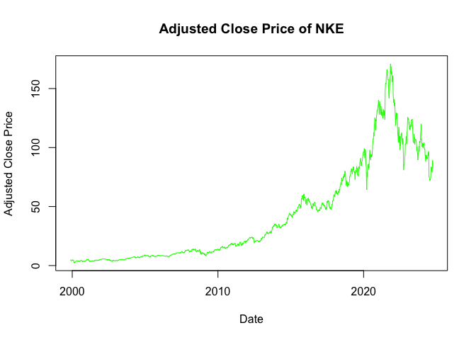

alphavantager
================
William HU ZIHAO
2024-10-07

``` r
library(alphavantager)
alphavantage_key <- "SOOVBPKYDOQUGMSF"
av_api_key(alphavantage_key)
```

``` r
ticker <- toupper('nke')
```

``` r
df_res <- tryCatch({
  av_get(ticker, av_fun = "TIME_SERIES_WEEKLY_ADJUSTED", outputsize = "compact")
}, error = function(e) {
  NULL  
})
```

    ## Rows: 1300 Columns: 8
    ## ── Column specification ────────────────────────────────────────────────────────
    ## Delimiter: ","
    ## dbl  (7): open, high, low, close, adjusted close, volume, dividend amount
    ## date (1): timestamp
    ## 
    ## ℹ Use `spec()` to retrieve the full column specification for this data.
    ## ℹ Specify the column types or set `show_col_types = FALSE` to quiet this message.

``` r
if (!is.null(df_res)) {
  saveRDS(df_res, file = paste0(ticker, ".Rds"))
  plot(df_res$timestamp, df_res$adjusted_close, type = "l", col = "green", 
       main = paste("Adjusted Close Price of", ticker), 
       xlab = "Date", ylab = "Adjusted Close Price")

} else {
  cat(paste("Failed to fetch data for ticker:", ticker))
}
```

<!-- -->
