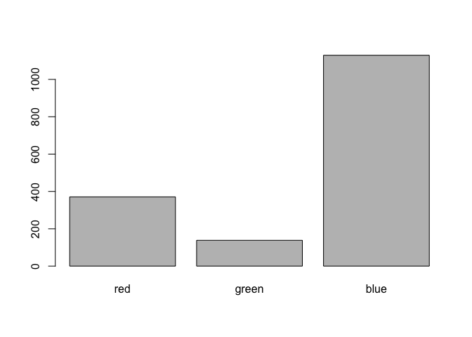
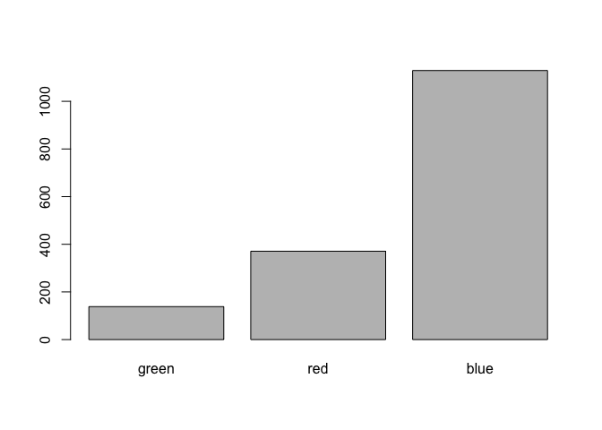
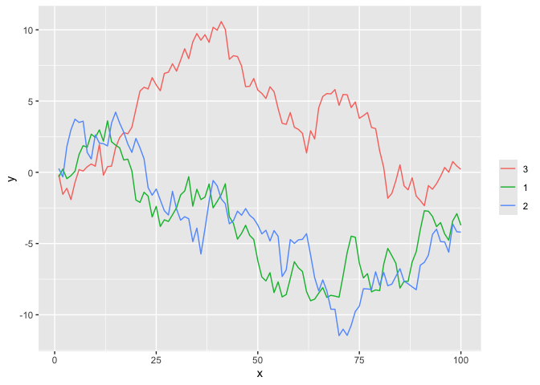

Chapter10 Factor
================

## 10.1 Factor

``` r
x <- c("男", "女", "男", "男",  "女")
sex <- factor(x)
sex
```

    ## [1] 男 女 男 男 女
    ## Levels: 女 男

``` r
## [1] 男 女 男 男 女
## Levels: 男 女
attributes(sex)
```

    ## $levels
    ## [1] "女" "男"
    ## 
    ## $class
    ## [1] "factor"

``` r
## $levels
## [1] "男" "女"
## 
## $class
## [1] "factor"
```

``` r
levels(sex)
```

    ## [1] "女" "男"

``` r
## [1] "男" "女"
class(sex)
```

    ## [1] "factor"

``` r
as.numeric(sex)
```

    ## [1] 2 1 2 2 1

``` r
## [1] 1 2 1 1 2
```

## 10.2 cut()

``` r
cut(1:10, breaks=c(0, 5, 10))
```

    ##  [1] (0,5]  (0,5]  (0,5]  (0,5]  (0,5]  (5,10] (5,10] (5,10] (5,10] (5,10]
    ## Levels: (0,5] (5,10]

``` r
set.seed(1)
x <- sort(round(rnorm(20), 2))
f <- cut(x, breaks=4); f
```

    ##  [1] (-2.21,-1.26]  (-1.26,-0.305] (-1.26,-0.305] (-1.26,-0.305] (-1.26,-0.305]
    ##  [6] (-1.26,-0.305] (-0.305,0.647] (-0.305,0.647] (-0.305,0.647] (-0.305,0.647]
    ## [11] (-0.305,0.647] (-0.305,0.647] (-0.305,0.647] (-0.305,0.647] (0.647,1.6]   
    ## [16] (0.647,1.6]    (0.647,1.6]    (0.647,1.6]    (0.647,1.6]    (0.647,1.6]   
    ## Levels: (-2.21,-1.26] (-1.26,-0.305] (-0.305,0.647] (0.647,1.6]

## 10.3 table()

``` r
table(sex)
```

    ## sex
    ## 女 男 
    ##  2  3

``` r
## sex
## 男 女 
##  3  2
```

## 10.4 tapply()

``` r
h <- c(165, 170, 168, 172, 159)
tapply(h, sex, mean)
```

    ##       女       男 
    ## 164.5000 168.3333

``` r
##       男       女 
## 168.3333 164.5000
```

## 10.5 forcats package

``` r
library(forcats)
set.seed(1)
fac <- sample(c("red", "green", "blue"), 30, replace=TRUE) |>
  factor(levels=c("red", "green", "blue"))
levels(fac)
```

    ## [1] "red"   "green" "blue"

``` r
## [1] "red"   "green" "blue"
fac3 <- fct_relevel(fac, "blue"); levels(fac3)
```

    ## [1] "blue"  "red"   "green"

``` r
## [1] "blue"  "red"   "green"
```

``` r
set.seed(1)
fac <- sample(c("red", "green", "blue"), 30, replace=TRUE)
fac <- factor(fac, levels=c("red", "green", "blue"))
x <- round(100*(10+rt(30,2)))
res1 <- tapply(x, fac, sd); res1
```

    ##       red     green      blue 
    ##  370.9222  138.3185 1129.2587

``` r
##       red     green      blue 
##  370.9222  138.3185 1129.2587
barplot(res1)
```

<!-- -->

``` r
fac2 <- fct_reorder(fac, x, sd)
res2 <- tapply(x, fac2, sd)
barplot(res2)
```

<!-- -->

``` r
library(tidyverse)
```

    ## ── Attaching core tidyverse packages ──────────────────────── tidyverse 2.0.0 ──
    ## ✔ dplyr     1.1.4     ✔ readr     2.1.5
    ## ✔ ggplot2   3.5.0     ✔ stringr   1.5.0
    ## ✔ lubridate 1.9.3     ✔ tibble    3.2.1
    ## ✔ purrr     1.0.2     ✔ tidyr     1.3.1
    ## ── Conflicts ────────────────────────────────────────── tidyverse_conflicts() ──
    ## ✖ dplyr::filter() masks stats::filter()
    ## ✖ dplyr::lag()    masks stats::lag()
    ## ℹ Use the conflicted package (<http://conflicted.r-lib.org/>) to force all conflicts to become errors

``` r
set.seed(101)
d.rd <- tibble(
  x = rep(1:100, 3),
  f = factor(rep(1:3, each=100)),
  y = c(cumsum(rnorm(100)), cumsum(rnorm(100)), cumsum(rnorm(100)))
)
d.rd
```

    ## # A tibble: 300 × 3
    ##        x f           y
    ##    <int> <fct>   <dbl>
    ##  1     1 1     -0.326 
    ##  2     2 1      0.226 
    ##  3     3 1     -0.449 
    ##  4     4 1     -0.234 
    ##  5     5 1      0.0766
    ##  6     6 1      1.25  
    ##  7     7 1      1.87  
    ##  8     8 1      1.76  
    ##  9     9 1      2.67  
    ## 10    10 1      2.45  
    ## # ℹ 290 more rows

``` r
ggplot(d.rd, aes(
  x = x, 
  y = y, 
  color = forcats::fct_reorder2(f, x, y))) +
  geom_line() +
  scale_color_discrete(name="")
```

<!-- -->

Practice

``` r
d.class <- read.csv('./data/class.csv', header=TRUE)
sex <- d.class[,'sex']
age <- d.class[,'age']
```

``` r
class(sex)
```

    ## [1] "character"

``` r
class(age)
```

    ## [1] "integer"

``` r
table(sex)
```

    ## sex
    ##  F  M 
    ##  9 10

``` r
tapply(age,sex,max)
```

    ##  F  M 
    ## 15 16

``` r
## 把sex变量转换为一个新的因子，F显示成“Female”，M显示成“Male”。
d.class$sex <- factor(d.class$sex, levels = c("F", "M"), labels = c('Female', 'Male'))
str(d.class)
```

    ## 'data.frame':    19 obs. of  5 variables:
    ##  $ name  : chr  "Alice" "Becka" "Gail" "Karen" ...
    ##  $ sex   : Factor w/ 2 levels "Female","Male": 1 1 1 1 1 1 1 1 1 2 ...
    ##  $ age   : int  13 13 14 12 12 15 11 15 14 14 ...
    ##  $ height: num  56.5 65.3 64.3 56.3 59.8 66.5 51.3 62.5 62.8 69 ...
    ##  $ weight: num  84 98 90 77 84.5 ...
