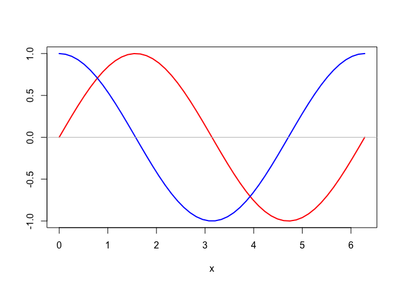

Chapter17 Function
================

## 17.1 Function Fundamentals

``` r
f <- function() {
  x <- seq(0, 2*pi, length=50)
  y1 <- sin(x)
  y2 <- cos(x)
  plot(x, y1, type="l", lwd=2, col="red",
       xlab="x", ylab="")
  lines(x, y2, lwd=2, col="blue")
  abline(h=0, col="gray")
}
f()
```

<!-- -->

``` r
f <- function(x) 1/sqrt(1 + x^2)
```

``` r
f(1)
```

    ## [1] 0.7071068

``` r
1/sqrt(1+1)
```

    ## [1] 0.7071068

``` r
## Alternatively
f2 <- \(x) 1/sqrt(1 + x^2)
f2(1)
```

    ## [1] 0.7071068

``` r
skewness <- function(x) {
  n <- length(x)
  xbar <- mean(x)
  S <- sd(x)
  n/(n-1)/(n-2)*sum( (x - xbar)^3 ) / S^3
}
```

``` r
fsub <- function(x, y=0){
  cat("x=", x, " y=", y, "\n")
  x - y
}
```

``` r
body(fsub)
```

    ## {
    ##     cat("x=", x, " y=", y, "\n")
    ##     x - y
    ## }

``` r
formals(fsub)
```

    ## $x
    ## 
    ## 
    ## $y
    ## [1] 0

``` r
environment(fsub)
```

    ## <environment: R_GlobalEnv>

``` r
fsub(3, 1)
```

    ## x= 3  y= 1

    ## [1] 2

``` r
## x= 3  y= 1
## [1] 2
fsub(3)
```

    ## x= 3  y= 0

    ## [1] 3

``` r
## x= 3  y= 0
## [1] 3
```

``` r
fsub(x=3, y=1)
```

    ## x= 3  y= 1

    ## [1] 2

``` r
## x= 3  y= 1
## [1] 2
fsub(y=1, x=3)
```

    ## x= 3  y= 1

    ## [1] 2

``` r
## x= 3  y= 1
## [1] 2
fsub(x=3)
```

    ## x= 3  y= 0

    ## [1] 3

``` r
## x= 3  y= 0
## [1] 3
fsub(3, y=1)
```

    ## x= 3  y= 1

    ## [1] 2

``` r
## x= 3  y= 1
## [1] 2
fsub(1, x=3)
```

    ## x= 3  y= 1

    ## [1] 2

``` r
## x= 3  y= 1
## [1] 2
fsub(x=3, 1)
```

    ## x= 3  y= 1

    ## [1] 2

``` r
## x= 3  y= 1
## [1] 2
```

在调用函数时， 如果以"形参名=实参值"的格式输入参数，
则"形参名"与定义时的形参名完全匹配时最优先采用；
如果"形参名"是定义时的形参名的前一部分子串， 即部分匹配，
这时调用表中如果没有其它部分匹配，
也可以输入到对应的完整形参名的参数中； 按位置匹配是最后才进行的。
有缺省值的形参在调用时可省略。

形参的部分匹配虽然可以节省一丁点儿键入工作量， 但是很不严谨， 容易出错，
所以应避免使用。 现在不能关闭这种语法， 可以用

``` r
## options(warnPartialMatchArgs = TRUE)
```

``` r
# x |>
#   sqrt() |>
#   sin()
```

or

``` r
## sum(log(x, b))
```

or

``` r
# x |>
#   log(base = b) |>
#   sum()
```

``` r
x <- c(2,1,3,5,4)
x |>
  diff() |>
  (\(x) x > 0)() |>
  as.numeric() |>
  (\(x) c(0, x))()
```

    ## [1] 0 0 1 1 0

``` r
## [1] 0 0 1 1 0
```

``` r
fib1 <- function(n){
  if(n == 0) return(0)
  else if(n == 1) return(1)
  else if(n >=2 ) {
    return(Recall(n-1) + Recall(n-2))
  }
}
for(i in 0:10) cat("i =", i, " x[i] =", fib1(i), "\n")
```

    ## i = 0  x[i] = 0 
    ## i = 1  x[i] = 1 
    ## i = 2  x[i] = 1 
    ## i = 3  x[i] = 2 
    ## i = 4  x[i] = 3 
    ## i = 5  x[i] = 5 
    ## i = 6  x[i] = 8 
    ## i = 7  x[i] = 13 
    ## i = 8  x[i] = 21 
    ## i = 9  x[i] = 34 
    ## i = 10  x[i] = 55

anonymous function

``` r
vapply(iris[,1:4], function(x) max(x) - min(x), 0.0)
```

    ## Sepal.Length  Sepal.Width Petal.Length  Petal.Width 
    ##          3.6          2.4          5.9          2.4

or

``` r
vapply(iris[,1:4], \(x) max(x) - min(x), 0.0)
```

    ## Sepal.Length  Sepal.Width Petal.Length  Petal.Width 
    ##          3.6          2.4          5.9          2.4

``` r
integrate(function(x) sin(x)^2, 0, pi)
```

    ## 1.570796 with absolute error < 1.7e-14

## 17.2 Scope

``` r
xv <- c(1,2,3)
xl <- list(a=11:15, b="James")
if(exists("x")) rm(x)
f <- function(x, y){
  cat("输入的 x=", x, "\n")
  x[2] <- -1
  cat("函数中修改后的 x=", x, "\n")
  cat("输入的y为:\n"); print(y)
  y[[2]] <- "Mary"
  cat("函数中修改过的y为:\n"); print(y)
}
f(xv, xl)
```

    ## 输入的 x= 1 2 3 
    ## 函数中修改后的 x= 1 -1 3 
    ## 输入的y为:
    ## $a
    ## [1] 11 12 13 14 15
    ## 
    ## $b
    ## [1] "James"
    ## 
    ## 函数中修改过的y为:
    ## $a
    ## [1] 11 12 13 14 15
    ## 
    ## $b
    ## [1] "Mary"

``` r
## 输入的 x= 1 2 3 
## 函数中修改后的 x= 1 -1 3 
## 输入的y为:
## $a
## [1] 11 12 13 14 15
## 
## $b
## [1] "James"
## 
## 函数中修改过的y为:
## $a
## [1] 11 12 13 14 15
## 
## $b
## [1] "Mary"
## 
cat("函数运行完毕后原来变量xv不变：", xv, "\n")
```

    ## 函数运行完毕后原来变量xv不变： 1 2 3

``` r
## 函数运行完毕后原来变量xv不变： 1 2 3 
cat("函数运行完毕后原来变量xl不变：:\n"); print(xl)
```

    ## 函数运行完毕后原来变量xl不变：:

    ## $a
    ## [1] 11 12 13 14 15
    ## 
    ## $b
    ## [1] "James"

``` r
## 函数运行完毕后原来变量xl不变：:
## $a
## [1] 11 12 13 14 15
## 
## $b
## [1] "James"
## 
cat("函数运行完毕后形式参数x不存在：:\n")
```

    ## 函数运行完毕后形式参数x不存在：:

``` r
## 函数运行完毕后形式参数x不存在：:
## Error in print(x) : object "x" not found
```

``` r
x.g <- 9999
f <- function(x){
  cat("函数内读取：全局变量 x.g = ", x.g, "\n")
  x.g <- -1
  cat("函数内对与全局变量同名的变量赋值： x.g = ", x.g, "\n")
}
f()
```

    ## 函数内读取：全局变量 x.g =  9999 
    ## 函数内对与全局变量同名的变量赋值： x.g =  -1

``` r
cat("退出函数后原来的全局变量不变： x.g =", x.g, "\n")
```

    ## 退出函数后原来的全局变量不变： x.g = 9999

``` r
x.g <- 9999
f <- function(x){
  cat("函数内读取：全局变量 x.g = ", x.g, "\n")
  x.g <<- -1
  cat("函数内用"<<-"对全局变量变量赋值： x.g = ", x.g, "\n")
}
f()
```

    ## 函数内读取：全局变量 x.g =  9999 
    ## 对全局变量变量赋值： x.g =  -1

``` r
cat("退出函数后原来的全局变量被修改了： x.g =", x.g, "\n")
```

    ## 退出函数后原来的全局变量被修改了： x.g = -1
