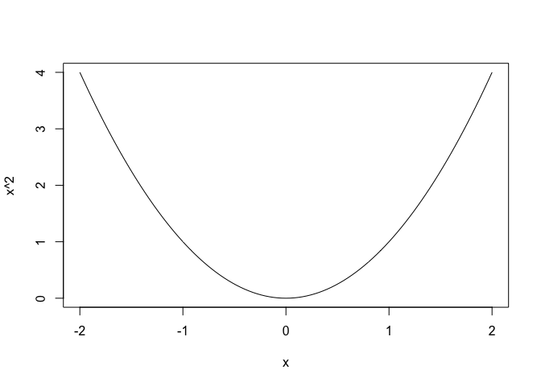
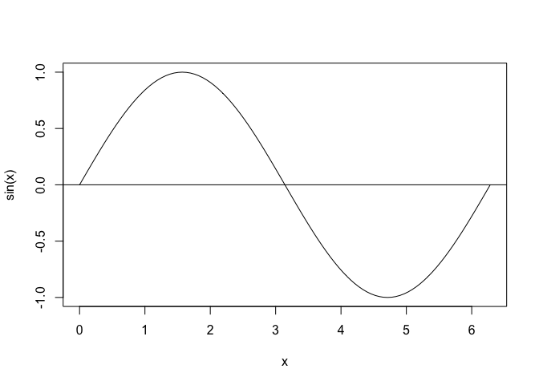
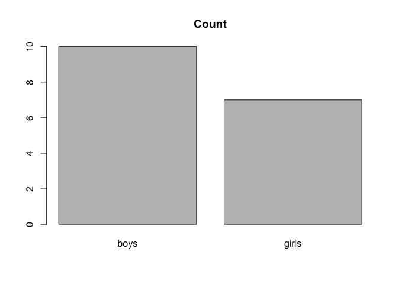

Chapter2 Intro to R
================

## 2.1 Console/Command Line

## 2.2 Basic Arithmetic Computation

``` r
5 + (2.3 - 1.125)*3.2/1.1 + 1.23E3
```

    ## [1] 1238.418

``` r
## [1] 1238.418
```

``` r
2^10
```

    ## [1] 1024

Practice

1.  principal = 10,000 annual interest rate = 3% what is the total
    amount of p and i after 10 years?

``` r
print(10000*((1+0.03)^10)) 
```

    ## [1] 13439.16

2.  p1 = 0.99 p2 = 0.01

``` r
cat("smart guy:",1-0.99^1000,"\n")
```

    ## smart guy: 0.9999568

``` r
cat("stupid guy:",1-0.99^1000,"\n")
```

    ## stupid guy: 0.9999568

## 2.3 Maths Function

``` r
sqrt(6.25)
```

    ## [1] 2.5

``` r
## [1] 2.5
exp(1)
```

    ## [1] 2.718282

``` r
## [1] 2.718282
log10(10000)
```

    ## [1] 4

``` r
## [1] 4
```

``` r
round(1.1234, 2)
```

    ## [1] 1.12

``` r
## [1] 1.12
round(-1.9876, 2)
```

    ## [1] -1.99

``` r
## [1] -1.99
floor(1.1234)
```

    ## [1] 1

``` r
## [1] 1
floor(-1.1234)
```

    ## [1] -2

``` r
## [1] -2
ceiling(1.1234)
```

    ## [1] 2

``` r
## [1] 2
ceiling(-1.1234)
```

    ## [1] -1

``` r
## [1] -1
```

``` r
pi
```

    ## [1] 3.141593

``` r
## [1] 3.141593
sin(pi/6)
```

    ## [1] 0.5

``` r
## [1] 0.5
cos(pi/6)
```

    ## [1] 0.8660254

``` r
## [1] 0.8660254
sqrt(3)/2
```

    ## [1] 0.8660254

``` r
## [1] 0.8660254
tan(pi/6)
```

    ## [1] 0.5773503

``` r
## [1] 0.5773503
```

``` r
pi/6
```

    ## [1] 0.5235988

``` r
## [1] 0.5235988
asin(0.5)
```

    ## [1] 0.5235988

``` r
## [1] 0.5235988
acos(sqrt(3)/2)
```

    ## [1] 0.5235988

``` r
## [1] 0.5235988
atan(sqrt(3)/3)
```

    ## [1] 0.5235988

``` r
## [1] 0.5235988
```

``` r
dnorm(1.98)
```

    ## [1] 0.05618314

``` r
## [1] 0.05618314
pnorm(1.98)
```

    ## [1] 0.9761482

``` r
## [1] 0.9761482
qnorm(0.975)
```

    ## [1] 1.959964

``` r
## [1] 1.959964
```

## 2.4 Self-Defined Function

``` r
frat <- function(x){
  (1 + x + 2*x^2)/(1 + 3*x + 2*x^2 + x^3)
}

frat(2)
```

    ## [1] 0.4782609

## 2.5 I/O Control

``` r
print(sin(pi/2))
```

    ## [1] 1

``` r
cat("sin(pi/2)=", sin(pi/2), "\n")
```

    ## sin(pi/2)= 1

``` r
## sin(pi/2)= 1 
```

## 2.6 Vectors

``` r
x1 <- 1:10
x1
```

    ##  [1]  1  2  3  4  5  6  7  8  9 10

``` r
marks <- c(3, 5, 10, 5, 6)
marks
```

    ## [1]  3  5 10  5  6

## 2.7 Working Directories

``` r
getwd()
```

    ## [1] "/Users/huzihao/Documents/Learn_R/PKU_R_TUT"

## 2.8 Plots

``` r
curve(x^2, -2, 2)
```

<!-- -->

``` r
curve(sin(x), 0, 2*pi)
abline(h=0)
```

<!-- -->

``` r
barplot(c("boys"=10, "girls"=7), 
    main="Count")
```

<!-- -->

## 2.9 Summary Statistics

``` r
library(readr)
tax.tab <- read_csv("data/taxsamp.csv", 
  locale=locale(encoding="GB18030"),show_col_types = FALSE)
print(head(tax.tab))
```

    ## # A tibble: 6 × 5
    ##   公司编号 日期                征收方式     申报渠道  营业额
    ##      <dbl> <dttm>              <chr>        <chr>      <dbl>
    ## 1     9913 2014-01-13 12:52:49 查帐征收     网上申报  36820 
    ## 2     9913 2014-01-14 15:49:28 查帐征收     网上申报  36820 
    ## 3     9913 2014-01-14 15:49:28 定期定率征收 网上申报 786902.
    ## 4     9913 2014-01-14 15:49:28 查帐征收     网上申报    105.
    ## 5     9913 2014-01-14 15:49:28 查帐征收     网上申报    105.
    ## 6     9913 2014-01-14 15:49:28 查帐征收     网上申报    105.

``` r
table(tax.tab[["征收方式"]])
```

    ## 
    ## 定期定率征收 定期定额征收     查帐征收 
    ##            2           16           31

``` r
table(tax.tab[["申报渠道"]])
```

    ## 
    ## 大厅申报 网上申报 
    ##       18       31

``` r
knitr::kable(table(tax.tab[["征收方式"]], tax.tab[["申报渠道"]]))
```

|              | 大厅申报 | 网上申报 |
|:-------------|---------:|---------:|
| 定期定率征收 |        0 |        2 |
| 定期定额征收 |        9 |        7 |
| 查帐征收     |        9 |       22 |

``` r
summary(tax.tab[["营业额"]])
```

    ##    Min. 1st Qu.  Median    Mean 3rd Qu.    Max. 
    ##       0     650    2130  247327    9421 6048000

## 2.10 Execute Source Files

``` r
source("ssq.R")
sum_squares(1:10)
```

    ## [1] 385
