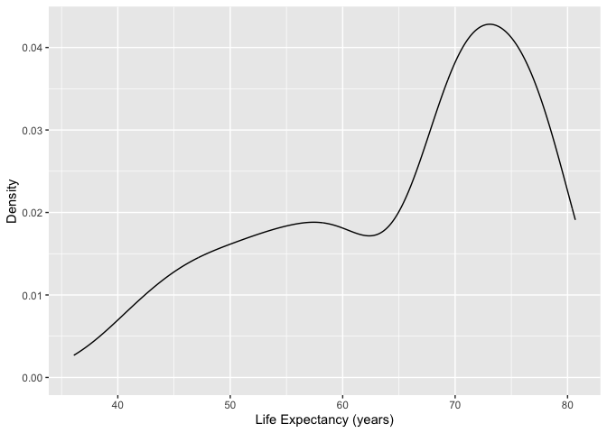

Chapter 5 Univariate Graphical Displays
================

``` r
library(gapminder)
library(tidyverse)
```

    ## ── Attaching core tidyverse packages ──────────────────────── tidyverse 2.0.0 ──
    ## ✔ dplyr     1.1.4     ✔ readr     2.1.5
    ## ✔ forcats   1.0.0     ✔ stringr   1.5.0
    ## ✔ ggplot2   3.5.0     ✔ tibble    3.2.1
    ## ✔ lubridate 1.9.3     ✔ tidyr     1.3.1
    ## ✔ purrr     1.0.2     
    ## ── Conflicts ────────────────────────────────────────── tidyverse_conflicts() ──
    ## ✖ dplyr::filter() masks stats::filter()
    ## ✖ dplyr::lag()    masks stats::lag()
    ## ℹ Use the conflicted package (<http://conflicted.r-lib.org/>) to force all conflicts to become errors

In this section we will show examples of how to create graphical
displays of a single variable - with examples for both quantitative and
categorical variables. In each example, the first line creates the
dataset to be graphed - followed by a command making the display. We
will focus on graphical displays made by functions in the *ggplot2*
family - that is, the *ggplot2* package which is also part of the
*tidyverse* family of functions. If *tidyverse* is loaded, *ggplot2*
functions will work without explicitly loading the *ggplot2* package.

## 5.1 Overview of ggplot

The *ggplot2* package uses the `ggplot` command - and builds a graphical
display in steps and layers. We always start with the `ggplot` command
which typically has two basic elements: a dataset to be used, and a list
of mappings `aes` that is used to connect dataset variables to aspects
of the plot like the vertical axis, horizontal axis, or perhaps the size
of a point.

The kind of object being displayed is called a `geom`, and a plot can
have several `geom`s, and they are added to a display in layers -
connected by a `+` sign.

## 5.2 A Quantitative Variable

### 5.2.1 Dotplot

``` r
ds <- gapminder %>% filter(year==1997) 
#
ggplot(data=ds, mapping=aes(x=lifeExp)) 
```

<!-- -->

``` r
ggplot(data=ds, mapping=aes(x=lifeExp)) + 
  geom_dotplot(dotsize=0.50) + 
  xlab("Life Expectancy (years)") + ylab("Frequency")
```

    ## Bin width defaults to 1/30 of the range of the data. Pick better value with
    ## `binwidth`.

<!-- -->

#### 5.2.1.1 Dotplot with observations identified and ordered

``` r
ds <- gapminder %>% filter(continent=="Asia",year==1997) 
#  
ggplot(data=ds, mapping=aes(x=lifeExp, y= reorder(country,lifeExp))) + 
  geom_point() + 
  labs(title="Life Expectancy in Asian Countries",
       subtitle="Year=1997",
       x="Life Expectancy (years) in 1997",
       y="Asian Countries")
```

<!-- -->

``` r
gapminder %>% filter(continent=="Asia",year==1997) %>%
ggplot(mapping=aes(x=lifeExp, y= reorder(country,lifeExp))) + 
  geom_point() + 
  xlab("Life Expectancy (years) in 1997") + 
  ylab("Asian Countries")
```

<!-- -->

### 5.2.2 Histogram

This code block is similar to the dotplot commands, but the
geom_histogram function controls the bin width in units of the x
variable - in this case 5 years.

``` r
gapminder %>% filter(year==1997) %>%
ggplot(data=.,mapping=aes(x=lifeExp)) + 
  geom_histogram(binwidth=3) + 
  xlab("Life Expectancy (years)") +
  ylab("Relative Frequency")
```

<!-- -->

### 5.2.3 Density Plot

``` r
gapminder%>%dplyr::filter(year==1997)%>%ggplot(data=., mapping=aes(x=lifeExp)) + 
  geom_density(adjust=0.9) + 
  xlab("Life Expectancy (years)") +
  ylab("Density")
```

<!-- -->

### 5.2.4 Boxplot

``` r
ds <- gapminder %>% filter(year==1997) 
#
ggplot(data=ds, mapping=aes(x=factor(year),y=lifeExp)) +
 geom_boxplot() + 
  labs(x="Year",
       y="Life Expectancy (years)")
```

<!-- -->

## 5.3 Displays of a Categorical Variable

### 5.3.1 Bar Graph

``` r
ds <- gapminder %>% 
  filter(year==1997) %>% 
  group_by(continent) 
# Frequency of countries in each continent in 1997.
ggplot(data=ds, mapping=aes(x=continent)) + 
  geom_bar() +
  labs(x="Continent", y="Frequency")
```

<!-- -->

### 5.3.2 Pie Graph

``` r
contin.prop<- gapminder %>% 
  group_by(continent) %>%
  summarise (n = n()) %>%
  mutate(freq = n / sum(n))
#
ggplot(data=contin.prop, mapping=aes(x="",y=freq,fill=continent)) + 
  geom_bar(width=1,stat="identity") +
  coord_polar("y",start=0) +
  xlab("") + ylab("Country Frequency by Continent")
```

<!-- -->
