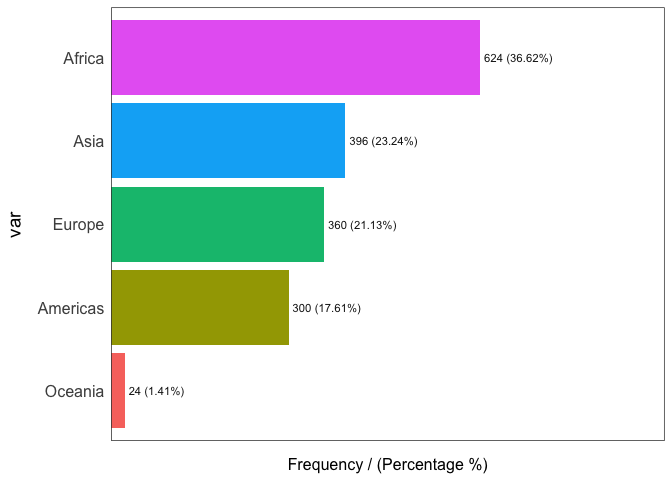

Chapter 6 Summary Statistics For One Variable
================

``` r
library(gapminder)
library(tidyverse)
```

    ## ── Attaching core tidyverse packages ──────────────────────── tidyverse 2.0.0 ──
    ## ✔ dplyr     1.1.4     ✔ readr     2.1.5
    ## ✔ forcats   1.0.0     ✔ stringr   1.5.0
    ## ✔ ggplot2   3.5.0     ✔ tibble    3.2.1
    ## ✔ lubridate 1.9.3     ✔ tidyr     1.3.1
    ## ✔ purrr     1.0.2     
    ## ── Conflicts ────────────────────────────────────────── tidyverse_conflicts() ──
    ## ✖ dplyr::filter() masks stats::filter()
    ## ✖ dplyr::lag()    masks stats::lag()
    ## ℹ Use the conflicted package (<http://conflicted.r-lib.org/>) to force all conflicts to become errors

## 6.1 One Quantitative Variable

### 6.1.1 Using base R summary function

``` r
gapminder %>% filter(year==1997) %>% select(lifeExp) %>% summary()
```

    ##     lifeExp     
    ##  Min.   :36.09  
    ##  1st Qu.:55.63  
    ##  Median :69.39  
    ##  Mean   :65.01  
    ##  3rd Qu.:74.17  
    ##  Max.   :80.69

### 6.1.2 Using dplyr summarise function

``` r
gapminder %>% dplyr::filter(year==1997) %>% 
      dplyr::summarise(meanLE=mean(lifeExp,na.rm=TRUE),
                       medLE=median(lifeExp,na.rm=TRUE),
                       sd=sd(lifeExp,na.rm=TRUE),
                       iqr=IQR(lifeExp,na.rm=TRUE),
                      Q1=quantile(lifeExp,probs=0.25,na.rm=TRUE),
                      Q3=quantile(lifeExp,probs=0.75),
                      n=n())
```

    ## # A tibble: 1 × 7
    ##   meanLE medLE    sd   iqr    Q1    Q3     n
    ##    <dbl> <dbl> <dbl> <dbl> <dbl> <dbl> <int>
    ## 1   65.0  69.4  11.6  18.5  55.6  74.2   142

### 6.1.3 Summary Statistics Using funModeling package

``` r
funModeling::profiling_num(gapminder)
```

    ##    variable         mean      std_dev variation_coef        p_01        p_05
    ## 1      year 1.979500e+03 1.726533e+01    0.008722066   1952.0000   1952.0000
    ## 2   lifeExp 5.947444e+01 1.291711e+01    0.217187544     33.4926     38.4924
    ## 3       pop 2.960121e+07 1.061579e+08    3.586268548 154117.9200 475458.9000
    ## 4 gdpPercap 7.215327e+03 9.857455e+03    1.366182632    369.2201    547.9964
    ##          p_25         p_50         p_75         p_95         p_99   skewness
    ## 1    1965.750    1979.5000 1.993250e+03     2007.000 2.007000e+03  0.0000000
    ## 2      48.198      60.7125 7.084550e+01       77.437 8.023892e+01 -0.2524798
    ## 3 2793664.000 7023595.5000 1.958522e+07 89822054.500 6.319900e+08  8.3328742
    ## 4    1202.060    3531.8470 9.325462e+03    26608.333 3.678357e+04  3.8468819
    ##    kurtosis          iqr                       range_98
    ## 1  1.783217 2.750000e+01                   [1952, 2007]
    ## 2  1.873099 2.264750e+01            [33.4926, 80.23892]
    ## 3 80.716151 1.679156e+07  [154117.92, 631990000.000002]
    ## 4 30.431702 8.123402e+03 [369.220127794, 36783.5723707]
    ##                       range_80
    ## 1                 [1957, 2002]
    ## 2            [41.5108, 75.097]
    ## 3       [946367.1, 54801369.5]
    ## 4 [687.71836128, 19449.138209]

### 6.1.4 Summary Statistics: skimr package

The *skimr* package produces summary statistics about variables and
overviews for dataframes. It is easy to manipulate and use pipes,
select, and filter from the *tidyverse* family of packages.

The next code supplies a dataframe that contains both categorical
variables (continent), and numeric variables (lifeExp, gdpPercap).
Numeric variables are chosen with the `yank` function, then some
attributes are omitted from the display (n_missing, complete_rate) using
the `select` function from dplyr.

``` r
varlist <- c("n_missing","complete_rate")
gapminder %>% filter(year==1997) %>% 
  select(-year, -country, -pop) %>% 
  skimr::skim_without_charts() %>%
  skimr::yank("numeric") %>%
  dplyr::select(-one_of(varlist))
```

**Variable type: numeric**

| skim_variable |    mean |       sd |     p0 |     p25 |     p50 |      p75 |     p100 |
|:--------------|--------:|---------:|-------:|--------:|--------:|---------:|---------:|
| lifeExp       |   65.01 |    11.56 |  36.09 |   55.63 |   69.39 |    74.17 |    80.69 |
| gdpPercap     | 9090.18 | 10171.49 | 312.19 | 1366.84 | 4781.83 | 12022.87 | 41283.16 |

## 6.2 One Categorical Variable

### 6.2.1 Counting Values

``` r
gapminder %>% count(continent)
```

    ## # A tibble: 5 × 2
    ##   continent     n
    ##   <fct>     <int>
    ## 1 Africa      624
    ## 2 Americas    300
    ## 3 Asia        396
    ## 4 Europe      360
    ## 5 Oceania      24

### 6.2.2 Categorical variable: skimr package

``` r
gapminder %>% filter(year==1997) %>% 
  select(lifeExp,continent) %>% 
  skimr::skim_without_charts() %>%
  skimr::yank("factor") %>%
  dplyr::select(-n_missing,-ordered,-complete_rate)
```

**Variable type: factor**

| skim_variable | n_unique | top_counts                         |
|:--------------|---------:|:-----------------------------------|
| continent     |        5 | Afr: 52, Asi: 33, Eur: 30, Ame: 25 |

### 6.2.3 Categorical variable: funModeling package

The *funModeling* package gives an easy way to learn about categorical
variables of types: character and factor. There are two categorical
variables in the gapminder dataframe: country and continent. There are a
lot of countries, so we demonstrate this command for only the continent
variable.

``` r
# Frequency distribution of entire dataframe
# will produce lots of output and warnings
#funModeling::freq(gapminder)
# next command for one category variable:  continent
funModeling::freq(gapminder$continent)
```

    ## Warning: The `<scale>` argument of `guides()` cannot be `FALSE`. Use "none" instead as
    ## of ggplot2 3.3.4.
    ## ℹ The deprecated feature was likely used in the funModeling package.
    ##   Please report the issue at <https://github.com/pablo14/funModeling/issues>.
    ## This warning is displayed once every 8 hours.
    ## Call `lifecycle::last_lifecycle_warnings()` to see where this warning was
    ## generated.

<!-- -->

    ##        var frequency percentage cumulative_perc
    ## 1   Africa       624      36.62           36.62
    ## 2     Asia       396      23.24           59.86
    ## 3   Europe       360      21.13           80.99
    ## 4 Americas       300      17.61           98.60
    ## 5  Oceania        24       1.41          100.00

### 6.2.4 Categorical variable: janitor package

``` r
gapminder %>% 
  filter(year==1997) %>%
  select(continent) %>%
  table()
```

    ## continent
    ##   Africa Americas     Asia   Europe  Oceania 
    ##       52       25       33       30        2

``` r
#
gapminder %>% 
  filter(year==1997) %>%
  janitor::tabyl(continent,sort=TRUE) %>%
  janitor::adorn_pct_formatting(digits=2,affix_sign = TRUE) %>%
  knitr::kable()
```

| continent |   n | percent |
|:----------|----:|:--------|
| Africa    |  52 | 36.62%  |
| Americas  |  25 | 17.61%  |
| Asia      |  33 | 23.24%  |
| Europe    |  30 | 21.13%  |
| Oceania   |   2 | 1.41%   |
