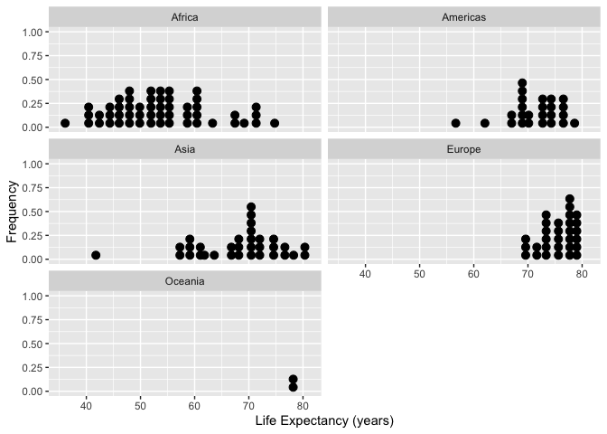
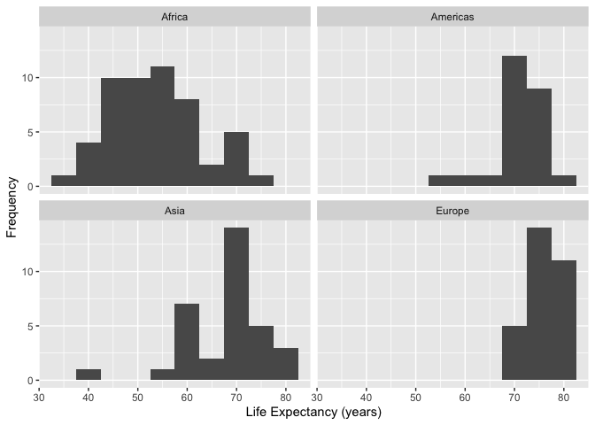
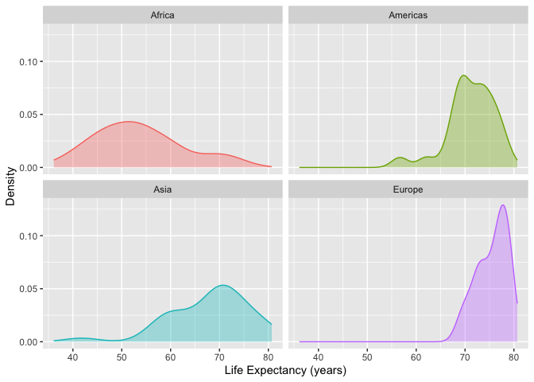
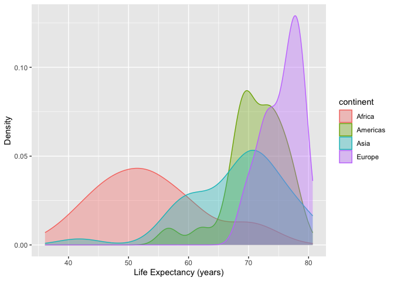
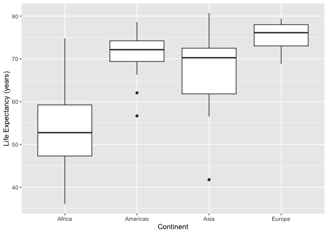
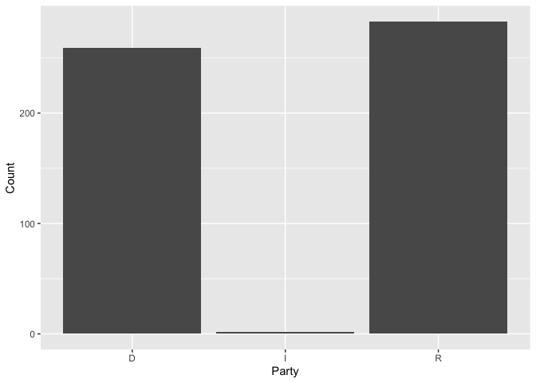
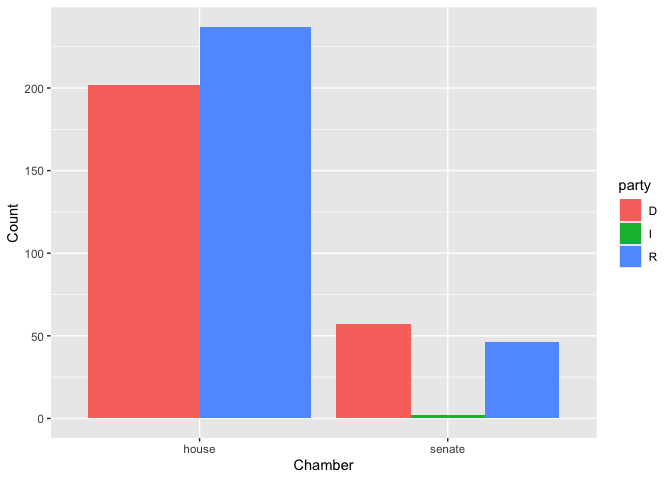
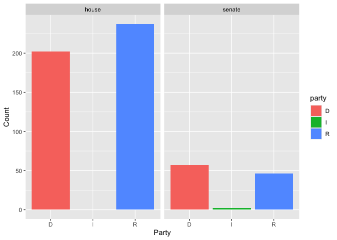

Chapter 7 Exploratory Data Analysis For One Quantitative Variable: by
Groups & Chapter 8 Analysis of One Categorical Variable by another
categorical variable
================

``` r
library(gapminder)
library(tidyverse)
```

    ## ── Attaching core tidyverse packages ──────────────────────── tidyverse 2.0.0 ──
    ## ✔ dplyr     1.1.4     ✔ readr     2.1.5
    ## ✔ forcats   1.0.0     ✔ stringr   1.5.0
    ## ✔ ggplot2   3.5.0     ✔ tibble    3.2.1
    ## ✔ lubridate 1.9.3     ✔ tidyr     1.3.1
    ## ✔ purrr     1.0.2     
    ## ── Conflicts ────────────────────────────────────────── tidyverse_conflicts() ──
    ## ✖ dplyr::filter() masks stats::filter()
    ## ✖ dplyr::lag()    masks stats::lag()
    ## ℹ Use the conflicted package (<http://conflicted.r-lib.org/>) to force all conflicts to become errors

## 7.1 Summary Statistics: dplyr

``` r
# Output presented in initial continent order (alphabetic)
gapminder %>% filter(year==1997) %>% 
  filter(continent != "Oceania") %>% 
  group_by(continent) %>% 
  summarise(meanLE=mean(lifeExp,na.rm=TRUE),
            medLE=median(lifeExp,na.rm=TRUE),
            sd=sd(lifeExp,na.rm=TRUE),
            iqr=IQR(lifeExp,na.rm=TRUE),
            Q1=quantile(lifeExp, probs=0.25,na.rm=TRUE),
            Q3=quantile(lifeExp,probs=0.75),
            n=n())
```

    ## # A tibble: 4 × 8
    ##   continent meanLE medLE    sd   iqr    Q1    Q3     n
    ##   <fct>      <dbl> <dbl> <dbl> <dbl> <dbl> <dbl> <int>
    ## 1 Africa      53.6  52.8  9.10 11.9   47.3  59.2    52
    ## 2 Americas    71.2  72.1  4.89  4.83  69.4  74.2    25
    ## 3 Asia        68.0  70.3  8.09 10.7   61.8  72.5    33
    ## 4 Europe      75.5  76.1  3.10  4.97  73.0  78.0    30

``` r
#
# Output rows ordered by decreasing values of a statistic (mean Life Expectancy):
gapminder %>% filter(year==1997) %>% 
  filter(continent != "Oceania") %>% 
  group_by(continent) %>%
  summarise(meanLE=mean(lifeExp,na.rm=TRUE),
            medLE=median(lifeExp,na.rm=TRUE),
            sd=sd(lifeExp,na.rm=TRUE),
            iqr=IQR(lifeExp,na.rm=TRUE),
            min=min(lifeExp),
            max=max(lifeExp),
            n=n())  %>%
  arrange(desc(meanLE))
```

    ## # A tibble: 4 × 8
    ##   continent meanLE medLE    sd   iqr   min   max     n
    ##   <fct>      <dbl> <dbl> <dbl> <dbl> <dbl> <dbl> <int>
    ## 1 Europe      75.5  76.1  3.10  4.97  68.8  79.4    30
    ## 2 Americas    71.2  72.1  4.89  4.83  56.7  78.6    25
    ## 3 Asia        68.0  70.3  8.09 10.7   41.8  80.7    33
    ## 4 Africa      53.6  52.8  9.10 11.9   36.1  74.8    52

``` r
gapminder %>% filter(year==1997) %>% 
  filter(continent != "Oceania") %>% 
  group_by(continent) %>% 
  summarise(meanLE=mean(lifeExp,na.rm=TRUE),
            medLE=median(lifeExp,na.rm=TRUE),
            sd=sd(lifeExp,na.rm=TRUE),
            iqr=IQR(lifeExp,na.rm=TRUE),
            min=min(lifeExp),
            max=max(lifeExp),
            n=n(),.groups = 'drop')  %>% 
  arrange(desc(meanLE)) %>%
  knitr::kable()
```

| continent |   meanLE |  medLE |       sd |      iqr |    min |    max |   n |
|:----------|---------:|-------:|---------:|---------:|-------:|-------:|----:|
| Europe    | 75.50517 | 76.116 | 3.104677 |  4.96625 | 68.835 | 79.390 |  30 |
| Americas  | 71.15048 | 72.146 | 4.887584 |  4.83500 | 56.671 | 78.610 |  25 |
| Asia      | 68.02052 | 70.265 | 8.091171 | 10.68100 | 41.763 | 80.690 |  33 |
| Africa    | 53.59827 | 52.759 | 9.103387 | 11.92825 | 36.087 | 74.772 |  52 |

## 7.2 Summary Statistics: skimr

``` r
gapminder %>% filter(year==1997) %>% 
  filter(continent != "Oceania") %>% 
  group_by(continent) %>% 
  skimr::skim_without_charts() %>%
  skimr::yank("numeric") %>%
  dplyr::filter(skim_variable %in% c("lifeExp","gdpPercap")) %>%
  knitr::kable()
```

| skim_variable | continent | n_missing | complete_rate |        mean |           sd |        p0 |        p25 |       p50 |         p75 |      p100 |
|:--------------|:----------|----------:|--------------:|------------:|-------------:|----------:|-----------:|----------:|------------:|----------:|
| lifeExp       | Africa    |         0 |             1 |    53.59827 |     9.103387 |   36.0870 |   47.30025 |    52.759 |    59.22850 |    74.772 |
| lifeExp       | Americas  |         0 |             1 |    71.15048 |     4.887584 |   56.6710 |   69.38800 |    72.146 |    74.22300 |    78.610 |
| lifeExp       | Asia      |         0 |             1 |    68.02052 |     8.091171 |   41.7630 |   61.81800 |    70.265 |    72.49900 |    80.690 |
| lifeExp       | Europe    |         0 |             1 |    75.50517 |     3.104677 |   68.8350 |   73.02350 |    76.116 |    77.98975 |    79.390 |
| gdpPercap     | Africa    |         0 |             1 |  2378.75956 |  2820.728117 |  312.1884 |  791.90197 |  1179.883 |  2856.38603 | 14722.842 |
| gdpPercap     | Americas  |         0 |             1 |  8889.30086 |  7874.225145 | 1341.7269 | 4684.31381 |  7113.692 |  9767.29753 | 35767.433 |
| gdpPercap     | Asia      |         0 |             1 |  9834.09330 | 11094.180481 |  415.0000 | 1902.25210 |  3645.380 | 19702.05581 | 40300.620 |
| gdpPercap     | Europe    |         0 |             1 | 19076.78180 | 10065.457716 | 3193.0546 | 9946.59931 | 19596.499 | 27189.53031 | 41283.164 |

## 7.3 Graphical Displays of a quantitative variable, separated by groups

In each example, the first lines create the dataset to be graphed -
followed by a `ggplot` command making the display. Several of the
examples make use of the principle of “small-multiples” so that each
level of the factor variable has a separarate panel for the quantitative
variable display.

### 7.3.1 Dotplots

``` r
ds <- gapminder %>% filter(year==1997) 
#
ggplot(data=ds,mapping=aes(x=lifeExp)) + 
  geom_dotplot() + 
  facet_wrap( ~ continent,ncol=2) + 
  xlab("Life Expectancy (years)") +
  ylab("Frequency")
```

    ## Bin width defaults to 1/30 of the range of the data. Pick better value with
    ## `binwidth`.

<!-- -->

### 7.3.2 Histograms

``` r
gapminder %>% 
  filter(year==1997) %>% 
  filter(continent != "Oceania") %>% 
  group_by(continent) %>%
ggplot(data=., mapping=aes(x=lifeExp)) + 
  geom_histogram(binwidth=5) + 
  facet_wrap( ~ continent,ncol=2) + 
  xlab("Life Expectancy (years)") +
  ylab("Frequency")
```

<!-- -->

### 7.3.3 Density Plots in Facets

``` r
gapminder %>% 
  filter(year==1997) %>% 
  filter(continent != "Oceania") %>% 
  group_by(continent) %>%
ggplot(data=., mapping=aes(x=lifeExp, colour=continent, fill=continent)) + 
  geom_density(alpha = 0.35) + 
  xlab("Life Expectancy (years)") +
  ylab("Density") +
  facet_wrap( ~ continent, ncol = 2) +  
  theme(legend.position = "none")
```

<!-- -->

### 7.3.4 Overlaid Density Plots

``` r
gapminder %>% 
  filter(year==1997) %>% 
  filter(continent != "Oceania") %>% 
  group_by(continent) %>%
ggplot(data=., mapping=aes(x=lifeExp, colour=continent, fill=continent)) + 
  geom_density(alpha = 0.35) + 
  xlab("Life Expectancy (years)") +
  ylab("Density")
```

<!-- -->

### 7.3.5 Boxplots, Grouped Data

``` r
ds <- gapminder %>% 
  filter(year==1997) %>% 
  filter(continent != "Oceania") %>% 
  group_by(continent) 
#
ggplot(data=ds, mapping=aes(x=continent,y=lifeExp)) +
 geom_boxplot() + 
  labs(x="Continent",y="Life Expectancy (years)")
```

<!-- -->

## 8.1 Tables

``` r
congage <- fivethirtyeight::congress_age
ds1 <- congage %>% filter(congress > 112) %>% select(congress,chamber,state,party,incumbent,age) 
#  We declare party and chamber as factor/categorical variables, and control their levels.
ds1 <- ds1 %>% mutate(party = factor(party,levels=c("D","I","R")),
                    chamber = factor(chamber))
ds1 <- ds1 %>% na.omit()
ds <- ds1  
#
table(ds$chamber,ds$party)
```

    ##         
    ##            D   I   R
    ##   house  202   0 237
    ##   senate  57   2  46

``` r
#
mytable <- table(ds$chamber,ds$party)
#
prop.table(mytable) # cell percentages
```

    ##         
    ##                    D           I           R
    ##   house  0.371323529 0.000000000 0.435661765
    ##   senate 0.104779412 0.003676471 0.084558824

``` r
# Use package janitor
ds %>%  janitor::tabyl(chamber, party)
```

    ##  chamber   D I   R
    ##    house 202 0 237
    ##   senate  57 2  46

``` r
# row percentages
t2 <- ds %>%  janitor::tabyl(chamber, party)
t2 %>%
  janitor::adorn_percentages("row") %>%
  janitor::adorn_pct_formatting(digits = 2) %>%
  janitor::adorn_ns()
```

    ##  chamber            D         I            R
    ##    house 46.01% (202) 0.00% (0) 53.99% (237)
    ##   senate 54.29%  (57) 1.90% (2) 43.81%  (46)

``` r
# column percentages
t2 %>%
  janitor::adorn_percentages("col") %>%
  janitor::adorn_pct_formatting(digits = 2) %>%
  janitor::adorn_ns()
```

    ##  chamber            D           I            R
    ##    house 77.99% (202)   0.00% (0) 83.75% (237)
    ##   senate 22.01%  (57) 100.00% (2) 16.25%  (46)

``` r
# both row and column percentages
t2 %>%
  janitor::adorn_percentages("all") %>%
  janitor::adorn_pct_formatting(digits = 2) %>%
  janitor::adorn_ns()
```

    ##  chamber            D         I            R
    ##    house 37.13% (202) 0.00% (0) 43.57% (237)
    ##   senate 10.48%  (57) 0.37% (2)  8.46%  (46)

``` r
congage <- fivethirtyeight::congress_age
ds1 <- congage %>% filter(congress > 112) %>% select(congress,chamber,state,party,incumbent,age) 
#  We declare party and chamber as factor/categorical variables, and control their levels.
ds1 <- ds1 %>% mutate(party = factor(party,levels=c("D","I","R")),
                    chamber = factor(chamber))
ds1 <- ds1 %>% na.omit()
ds <- ds1  
ds %>% group_by(chamber,party) %>% 
  dplyr::count() %>% 
  tidyr::pivot_wider(names_from = party, values_from = n)
```

    ## # A tibble: 2 × 4
    ## # Groups:   chamber [2]
    ##   chamber     D     R     I
    ##   <fct>   <int> <int> <int>
    ## 1 house     202   237    NA
    ## 2 senate     57    46     2

## 8.2 Graphical Displays

``` r
# basic bar plot of party affiliation
ggplot(data=ds, mapping=aes(x=party)) + 
  geom_bar() +
  labs(x="Party", y="Count")
```

<!-- -->

``` r
ds <- ds1 %>% group_by(party,chamber)
#
ggplot(data=ds, aes(x=chamber)) + 
  geom_bar(aes(fill=party),position="dodge") +
  labs(x="Chamber", y="Count")
```

<!-- -->

``` r
#
ggplot(data=ds, aes(x=party)) + 
  geom_bar(aes(fill=party)) +
  facet_wrap( ~ chamber) +
  labs(x="Party", y="Count")
```

<!-- -->
